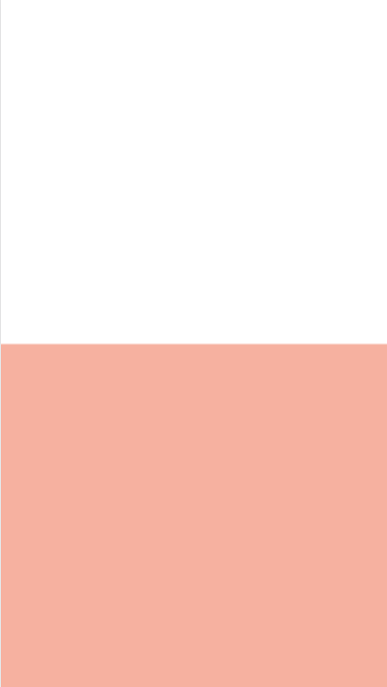
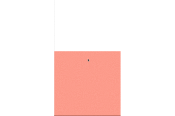
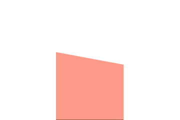
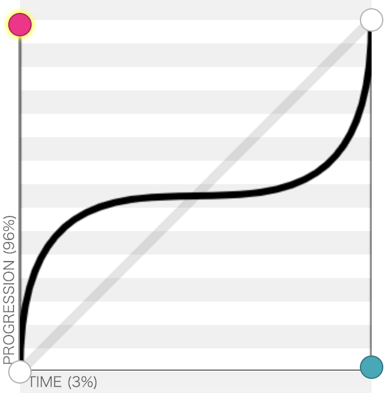
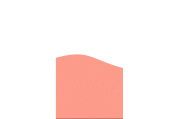
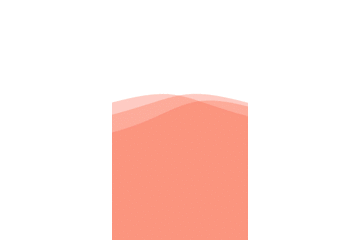

# 一个灵活的，可配置的波浪动画

## 先看效果

[效果展示](https://qishaoxuan.github.io/css_tricks/notCSS/wave.html)

[github](https://github.com/QiShaoXuan/wavejs)

## 起因

春节放假前的第二天上午，看到设计稿上的图（如下），于是发生了下面的对话


-我：把这个图传一下吧。

-UI：好的，你是要 gif 吧。

-我：啥？这个是个动画？

-UI：啥？这不是动画？

-我：打扰了。

于是在剩下的一天里，我撸出了这个[波浪动画](https://github.com/QiShaoXuan/wavejs)

## 开始准备

1. 想想需求

首先我们能想到的是，波浪的数量一定是可定制的，其次是颜色，速度，透明度，高度等等。这些可定制的参数应当在函数实例化时传入。所以我们先定制一个接口（包括了后来在编写时我认为需要的）。

```typescript
interface Options {
  number: number
  smooth: number
  velocity: number
  height: number
  colors: Array<{ hex: string, rgba: string }>
  opacity: number
  border: {
    show: boolean,
    width: number,
    color: string[]
  }
  position: 'top' | 'bottom' | 'left' | 'right'
}
```

不了解 typescript 的同学可以意会，`key` 指的传入变量的名称，`value` 为变量的类型规范

2. 设计接口

我们先预先想下可能发生的场景：

1. 动画需要指令化的开始或暂停
2. 可以通过方法实时设置或更改参数，并反映在动画上
3. 在动画的容器缩放时，画布应当能重新设置

所以我们暂时值规定四个类型为 `public` 接口 `animate`，`pause`，`setOptions`，`reset`

```typescript
interface Core {
  animate: () => void
  pause: () => void
  setOptions: (options: Object) => void
  reset: () => void
}
```

## 开始写动画

准备工作基本完成，现在开始编写核心动画。

1. 准备一个 canvas

基本操作，不多介绍。

```html
<body>
  <canvas id="canvas"></canvas>
</body>
```
```js
const canvas = document.getElementById('canvas')  
const ctx = canvas.getContext('2d')
canvas.width = document.body.offsetWidth  
canvas.height = document.body.offsetHeight
```

2. 先画一池水

画一个矩形，然后填充颜色。

```js
ctx.fillStyle = "rgba(255,118,87,.6)"
ctx.beginPath()
ctx.moveTo(0, canvas.height/2)
ctx.lineTo(canvas.width, canvas.height/2)
ctx.lineTo(canvas.width, canvas.height)
ctx.lineTo(0, canvas.height)
ctx.lineTo(0, canvas.height/2)
ctx.closePath()
ctx.fill()
```



3. 让水动起来

要让水池的水呈周期性的上涨和跌落，很容易想到借助正弦或者余弦函数来完成，在每一帧的渲染中将 `step` 增加 1 度，规定 50 为变化值，利用正弦函数将变化量作用于左右两个顶点上即可。

```js
  let step = 0
  
  function loop(){
    // 清空canvas
    ctx.clearRect(0,0,canvas.width,canvas.height)
    ctx.clearRect(0,0,canvas.width,canvas.height)
    ctx.fillStyle = "rgba(255,118,87,.6)"
    step++
    
    const angle = step * Math.PI / 180
    const deltaHeight   = Math.sin(angle) * 50
    
    ctx.beginPath()
    ctx.moveTo(0, canvas.height/2+deltaHeight)
    ctx.lineTo(canvas.width, canvas.height/2+deltaHeight)
    ctx.lineTo(canvas.width, canvas.height)
    ctx.lineTo(0, canvas.height)
    ctx.lineTo(0, canvas.height/2+deltaHeight)
    ctx.closePath()
    ctx.fill()

    requestAnimationFrame(loop)
  }
  
  loop()
```


4. 让水晃起来 

使左右顶点不同步即可让水面晃动起来，所以我们将左顶点的取值使用余弦函数即可。

```js
  let step = 0

  function loop() {
    //清空canvas
    ctx.clearRect(0, 0, canvas.width, canvas.height)
    ctx.clearRect(0, 0, canvas.width, canvas.height)
    ctx.fillStyle = "rgba(255,118,87,.6)"
    step++
    
    const angle = step * Math.PI / 180
    const deltaHeight = Math.sin(angle) * 50
    const deltaHeightRight = Math.cos(angle) * 50
    
    ctx.beginPath()
    ctx.moveTo(0, canvas.height / 2 + deltaHeight)
    ctx.lineTo(canvas.width, canvas.height / 2 + deltaHeightRight)
    ctx.lineTo(canvas.width, canvas.height)
    ctx.lineTo(0, canvas.height)
    ctx.lineTo(0, canvas.height / 2 + deltaHeight)
    ctx.closePath()
    ctx.fill()

    requestAnimationFrame(loop)
  }

  loop()
```



5. 制造波浪

借助贝塞尔曲线将矩形的一边变为波浪。



在 canvas 绘制中，我们借助 `bezierCurveTo(cpX1, cpY1, cpX2, cpY2, x, y)` 方法绘制贝塞尔曲线，由上图可见（歪脖 45 度查看更直观），两个控制点的横坐标应当设为矩形宽的中点，纵坐标跟随峰值变化即可。

```js
  let step = 0

  function loop() {
    //清空canvas
    ctx.clearRect(0, 0, canvas.width, canvas.height)
    ctx.clearRect(0, 0, canvas.width, canvas.height)
    ctx.fillStyle = "rgba(255,118,87,.6)"
    step++
    
    const angle = step * Math.PI / 180
    const deltaHeight = Math.sin(angle) * 50
    const deltaHeightRight = Math.cos(angle) * 50
    
    ctx.beginPath()
    ctx.moveTo(0, canvas.height/2+deltaHeight)
    ctx.bezierCurveTo(canvas.width /2, canvas.height/2+deltaHeight-50, canvas.width / 2, canvas.height/2+deltaHeightRight-50, canvas.width, canvas.height/2+deltaHeightRight)
    ctx.lineTo(canvas.width, canvas.height)
    ctx.lineTo(0, canvas.height)
    ctx.lineTo(0, canvas.height/2+deltaHeight)
    ctx.closePath()
    ctx.fill()

    requestAnimationFrame(loop)
  }

  loop()
```



6. 多个波浪

将上面的波浪写成 for 循环多次渲染即可。

```js
  let step = 0
  const lines = 3

  function loop() {
    ctx.clearRect(0, 0, canvas.width, canvas.height)
    step++
    for (let i = 0; i < lines; i++) {
      ctx.fillStyle = 'rgba(255,118,87,.3)'
      var angle = (step + i * 180 / lines) * Math.PI / 180
      var deltaHeight = Math.sin(angle) * 50
      var deltaHeightRight = Math.cos(angle) * 50
      ctx.beginPath()
      ctx.moveTo(0, canvas.height / 2 + deltaHeight)
      ctx.bezierCurveTo(canvas.width / 2, canvas.height / 2 + deltaHeight - 50, canvas.width / 2, canvas.height / 2 + deltaHeightRight - 50, canvas.width, canvas.height / 2 + deltaHeightRight)
      ctx.lineTo(canvas.width, canvas.height)
      ctx.lineTo(0, canvas.height)
      ctx.lineTo(0, canvas.height / 2 + deltaHeight)
      ctx.closePath()
      ctx.fill()
    }

    requestAnimationFrame(loop)
  }

  loop()
```



## 结语

核心代码已经叙述完毕，其余针对设置项的封装就不再赘述了（基本是将上述的核心部分进行变量化设置）。

如果你也有这样的需求，可以参考上述示例简单使用，也可以使用[我编写的](https://github.com/QiShaoXuan/wavejs)

最后的最后，欢迎 star ~

[github](https://github.com/QiShaoXuan/wavejs)


